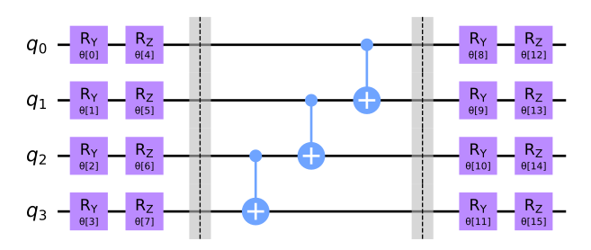
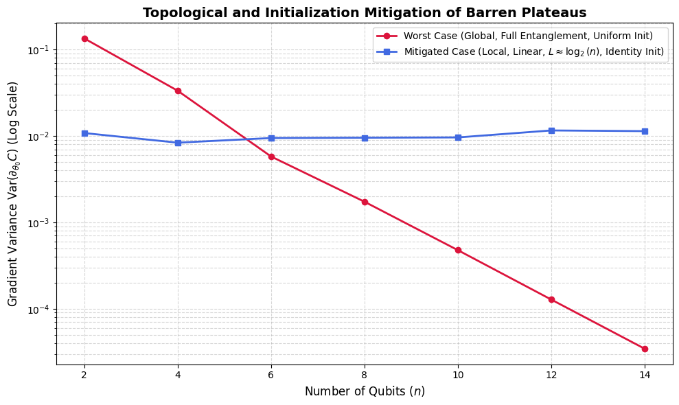
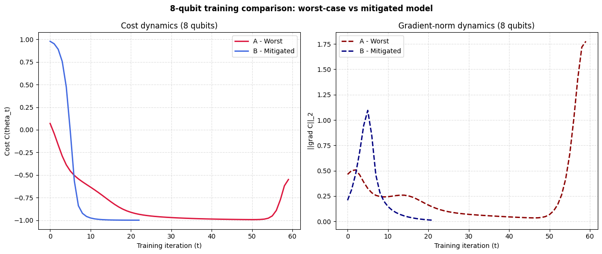

# Introduction

In today's quantum computing era, we are experiencing a lot of drawbacks that dont allow us the use of the power and advantages that this new technology can provide.

These drawbacks, problems yet to solve, can be conceptually divided into to groups:
- Hardware-driven problems (noise-induced barren plateaus, decoherence, qubit topology, etc...)
- Software-driven problems (mathematically-induced barren plateaus, lack of specific problem-solving algorithims, etc...)

Quantum engineers have developed a bunch of different approaches to solve different problems with quantum systems. In fact, quantum machine learning has been increasing in popularity for the past years because of the theoretical capabilites that they offer. Even so, at this day and age the advantages are theoretical, and there hasn't been any signs of  quantum supremacy (improvement in contrast with its classical counterpart) in the field of quantum machine learning.

As mentioned before, there is a plethora of reasons that can contribute to this problem, but in the field of QML, in general, there is a consensus on the most problematic one of all, and the one that is holding back the power of this technology: Barren Plateaus. In this day and age, there are already various proposed solutions (or areas to work into) for the problem at hand, but in the majority of them, the conclusions seemed to not be very conclusive, and the process to archive such solutions tend to be unplanned. The researches know what the problem is and how it happens, but when it comes to solve it, the try whatever they can think of to try and fix it. There is no clear reason behind the proposed changes, and because of that, the idea of mixing different solutions is quite challenging, as in this field any change in any area can have a big impact on the rest of areas.

My thesis will be about this concept, more specifically, about trying to dogde it by using different state-of-the-art solutions proposed for it. This alone wouldn't be so much of a challenge, as it is quite simple to apply any solution for a specific case in which the BP problem is avoided, so instead of doing so, the idea would be to experiment with different solutions based on different theoretical concepts, with the objective of mixing them and propose different approaches that,
in general, can work together to be a stronger option rather than any single-based solution.

## Review of important concepts

### Variational Quantum Algorithms (VQAs)

Variational Quantum Algorithms are hybrid quantum-classical computational frameworks designed to solve optimization problems on Noisy Intermediate-Scale Quantum (NISQ) devices. The architecture consists of a parameterized quantum circuit (often called an Ansatz), denoted by a unitary operation $U(\theta)$, which prepares a quantum state:
$$|\psi(\theta)\rangle = U(\theta)|0\rangle$$
A classical optimizer is then tasked with updating the parameter vector $\theta$ to minimize a specific objective function $C(\theta)$, typically the expectation value of an observable $H$, such that:
$$C(\theta) = \langle \psi(\theta)|H|\psi(\theta)\rangle$$

### The Barren Plateau Phenomenon

The theoretical advantages of VQAs are severely limited in practice by a trainability crisis known as the Barren Plateau phenomenon. This is not a hardware defect, but a fundamental mathematical barrier that emerges from the geometry of high-dimensional quantum spaces. The phenomenon develops through a strict causal chain:

**Expressibility and Unitary 2-Designs**
If a parameterized quantum circuit is sufficiently deep and entangled, it becomes highly expressive. Mathematically, it generates a distribution of unitaries that forms a unitary $2$-design. This means the statistical distribution of the generated quantum states perfectly mimics the uniform distribution over the entire unitary group (the Haar measure) up to the second statistical moment. At this point, the initial parameters do not provide any localized mathematical structure.

**Concentration of Measure**
Once the circuit forms a $2$-design in an $n$-qubit system, it operates uniformly across a Hilbert space of dimension $D = 2^n$. According to measure theory (Levy's Lemma), any sufficiently smooth function evaluated on a random point drawn uniformly from a high-dimensional space will yield a value extremely close to the function's expected value. The probability of deviation is exponentially bounded:
$$P(|f(x) - \mathbb{E}[f]| \ge \epsilon) \le 2 \exp(-\mathcal{O}(D \epsilon^2))$$

**Exponential Variance Decay (Vanishing Gradients)**
When applying the concentration of measure to the optimization process, the continuous function $f(x)$ is the partial derivative of the cost function, $\partial_{\theta_i} C$. Consequently, the value of the gradient concentrates exponentially around its mean. Since the mathematical mean of the gradient over the parameter space is zero ($\mathbb{E}[\partial_{\theta_i} C] = 0$), the statistical variance of the gradient decays exponentially with the number of qubits: $$\text{Var}[\partial_{\theta_i} C] \in \mathcal{O}\left(\frac{1}{b^n}\right) | \text{  }b > 1 $$ This exponential decay is precisely the quantum vanishing gradient. Unlike classical neural networks, where vanishing gradients are caused by the chain rule in deep layers, the quantum vanishing gradient is a direct geometric consequence of the Hilbert space dimensionality.

**Intractability on Physical Hardware**
The ultimate consequence of this exponential variance decay is the Barren Plateau. For a classical optimizer to determine a reliable descent direction, the variance of the gradient must stand out against the inherent statistical noise of quantum measurements (shot noise). To estimate a gradient with a variance of $\mathcal{O}(1/b^n)$ to a precision greater than the statistical noise, the number of hardware measurements (shots) required scales exponentially as $\mathcal{O}(b^n)$. This renders the optimization algorithm computationally intractable on physical hardware, paralyzing the training process at step zero.

# The Trainability Threshold: Polynomial vs. Exponential Scaling
While classical machine learning strives for, and achieves, a constant gradient variance $\mathcal{O}(1)$ regardless of network depth, quantum machine learning faces a fundamental mathematical boundary. A constant variance in a quantum circuit mathematically implies that the partial derivatives are completely decoupled from the overall system size $n$.

For this decoupling to occur, the circuit must lack significant entanglement. If the qubits do not interact deeply, the global state remains separable, meaning the multi-qubit wavefunction can be factored into a simple tensor product of single-qubit states. A quantum system with zero or strictly limited entanglement can be perfectly and efficiently simulated on a classical computer in polynomial time using tensor network methods. Therefore, forcing a parameterized quantum circuit to maintain an $\mathcal{O}(1)$ variance structurally eliminates the quantum advantage. To solve classically intractable problems, the Ansatz must generate complex, highly entangled states to explore the exponentially large Hilbert space. This entanglement inherently correlates the qubits, making the objective function and its gradients strictly dependent on the system's dimensionality.

Consequently, the theoretical optimum for a useful Quantum Neural Network is to mitigate the exponential decay to a polynomial scale $\mathcal{O}(1/\text{poly}(n))$. This specific scaling provides the necessary mathematical equilibrium: it allows sufficient entanglement to surpass classical computational capabilities while keeping the gradient variance large enough to be resolved by a physical QPU without requiring an exponential number of hardware measurements.

# Solutions

The vanishing gradient problem can be sistematically attacked from 3 different fronts: Topology/arquitechture, initialization and training dynamic. Each of these categories groups different solutions that are based on different theoretical concepts, and thus, they can be mixed together to create stronger solutions. Here are a few examples of solutions for each category:

## 1. Topology / arquitechture
This category groups all the options that change the Hilbert Space tha the circuit can explore. The objective of this solution is to prevent the system to reach the infamous 2-design circuit's properties, that basically mean that the variance of the parameters decay exponentially with the degree of the circuit, thus ending up with vanishing gradients. 

### Cost function (global vs local)
- No puedes escoger el observable de manera arbitraria simplemente para mejorar la varianza del gradiente, porque el observable es la traduccion
matemática directa del problema a resolver. La refactorización de un observable global a local es un campo de estudio activo hoy en día

-  Conviene utilizar un observable local en vez de global, en efecto, pero no siempre se puede. Matemáticamente, esto se basa en la propiedad de la linealidad del valor esperado. Si el observable global $H$ puede ser expresado como una suma de términos locales $H = \sum_i H_i$, entonces la función de costo se puede reformular como $$C(\theta) = \langle \psi(\theta)|H|\psi(\theta)\rangle = \sum_i \langle \psi(\theta)|H_i|\psi(\theta)\rangle$$Sin embargo, no todos los problemas permiten esta descomposición, y en algunos casos, la estructura del problema requiere un observable global para capturar las interacciones complejas entre qubits.

### Depth control (L)

### Problem-based Ansatze
Generic, hardware-efficient architectures (like `EfficientSU2`) are problem-agnostic and parameterize operations across all available degrees of freedom, which inherently leads to the uniform exploration characteristic of a 2-design. Problem-based Ansatze restructure the circuit by embedding the mathematical symmetries of the specific problem directly into the quantum gates.

A prime example is the Hamiltonian Variational Ansatz (HVA) or Equivariant Quantum Neural Networks. Instead of allowing arbitrary rotations, the parameterized gates are strictly constructed from the terms of the target Hamiltonian. This restricts the Dynamic Lie Algebra (DLA) of the circuit to a polynomially sized subspace. By confining the exploration to this specific symmetric subspace, the circuit is physically incapable of reaching a unitary 2-design, thereby avoiding the exponential concentration of measure regardless of the circuit's depth.

## 2. Initialization
This group assumes that the architecture can have BPs, and thus tries to avoid them from step 0 of the algorithm. Standard classical machine learning relies on randomly initializing the parameter vector $\theta_0$ from a uniform distribution, such as $[-\pi, \pi]$. In a highly expressive quantum circuit, this practice immediately maps the initial quantum state to the Haar measure.

Because the concentration of measure guarantees that the vast majority of the parameter space consists of flat regions where $\partial_{\theta_i} C \approx 0$, a random uniform initialization has a probability exponentially close to $1$ of placing the starting point exactly inside a Barren Plateau. Consequently, the initial gradient vector evaluated by the classical optimizer consists entirely of statistical noise, paralyzing the algorithm before the first update can occur.

### Identity initialization
Identity initialization addresses the random starting problem by structuring the initial parameter vector $\theta_0$ such that the unitary operations of sequential blocks precisely cancel each other out. At step zero, the global effect of the parameterized circuit resolves to the Identity operator $U(\theta_0) = I$.

Because the effective depth of the circuit at step zero is physically zero, the system has no entanglement and does not form a 2-design, guaranteeing a large, mathematically precise initial gradient. As the classical optimizer iteratively updates the parameters, they slowly diverge from zero. The circuit progressively acquires depth and entanglement, exploring the cost function while remaining guided by valid gradient signals during the critical early phases of the optimization.

### Warm starting
Warm starting bypasses the flat regions of the Hilbert space by leveraging classical computational methods to compute a highly informed initial parameter vector $\theta_0$. Instead of starting blindly, the algorithm utilizes classical approximations, such as Tensor Network simulations (e.g., Matrix Product States) or approximate classical heuristics, to solve a simplified version of the problem.

The classical output is then mapped onto the quantum parameters. This ensures that the quantum optimization begins inside the convergence basin (the localized region with steep gradients) of the global minimum. The quantum hardware is therefore only required to perform the final, classically intractable fine-tuning of the state, entirely circumventing the untrainable flat regions of the global parameter space.

...

## 3. Training dynamic
This category groups the strategies that modify the form in which the classical optimizer interacts with the circuit through time, assuming the architecture and the initialization are already established.

### Layerwise Learning

### Geometrical preconditioning

### Dynamic development of Ansatze

### Changes on the optimizer
When executing VQAs on physical hardware, the calculated gradients are not exact mathematical derivatives but statistical estimates corrupted by shot noise. Standard optimizers like COBYLA or basic Gradient Descent fail catastrophically when the gradient variance approaches the noise floor, as they mistake stochastic fluctuations for valid topological slopes.

Changing the optimizer to stochastic-specific algorithms, such as Simultaneous Perturbation Stochastic Approximation (SPSA) or its quantum geometric variant (QNSPSA), mathematically accounts for this noise. These optimizers evaluate the objective function using random perturbation vectors across all parameters simultaneously. This approach inherently averages out the statistical noise and maintains an operationally valid descent trajectory, even when the underlying gradient variance is highly suppressed by the hardware limitations.

# My investigation

## Comparison on Normal vs Enhanced circuits for BP mitigation
Before comparing the optimizers, i wanted to do a couple of tests of normal circuits vs circuits created with the mitigation of BPs in mind. 

### Initialization comparison
I designed this experiment as an initialization-level comparison, not as a full training run. For each qubit count $(n \in {2,4,6,8,10,12,14})$, I instantiate two circuit regimes: a worst-case setup with full entanglement, fixed depth (L=3), and a global cost $(Z^{\otimes n})$, and a mitigated setup with linear entanglement, depth $(L \approx \log_2(n))$, and a local cost on a single qubit.

For each regime and each (n), I run a Monte Carlo test at (t=0): I sample 150 random parameter vectors, estimate one gradient component $(\partial_{\theta_0}C)$ using the parameter-shift rule, and compute its variance. In the worst-case branch I initialize parameters uniformly in $([-\pi,\pi])$, while in the mitigated branch I use a narrow Gaussian centered at 0 to stay near identity initialization. I then compare how the gradient variance scales with (n) to evaluate how quickly gradients vanish in each regime.

The figure shows a clear result. The circuit in red followed an exponential decay (the column axis is logarithmical) while the circuit in red shows that for the first iteration, the chosen BP mitigation approaches worked nicely, not showing any decay with the increase in qubits.

###  8-qubit training comparison
In the next experiment, I move from the initialization-only test to a short optimization dynamics test at fixed size $(n=8)$. I keep the same two circuit families to make the comparison consistent.

I then train both models with the same Gradient Descent loop using exact parameter-shift gradients for all parameters at each iteration. I use identical optimization settings for both branches (learning rate $0.5$, maximum $60$ iterations, early stopping tolerance $10^{-4}$), and I track two temporal metrics: the cost trajectory $C(\theta_t)$ and the gradient norm $\|\nabla C\|_2$. This lets me compare not only where each model converges, but also how stable and informative the gradient signal remains during training.

We can see that for the optimized circuit, thanks to the initialization, the algorithm converges much faster and smoother, in comparison whith the non-optimized one. We can also see on the right figure, on the red curve, that the gradient almost falls to 0 before converging, almost reaching a 2-design.

## COBYLA vs QNSPSA

### Results analysis

# Notes

# Bilbiography