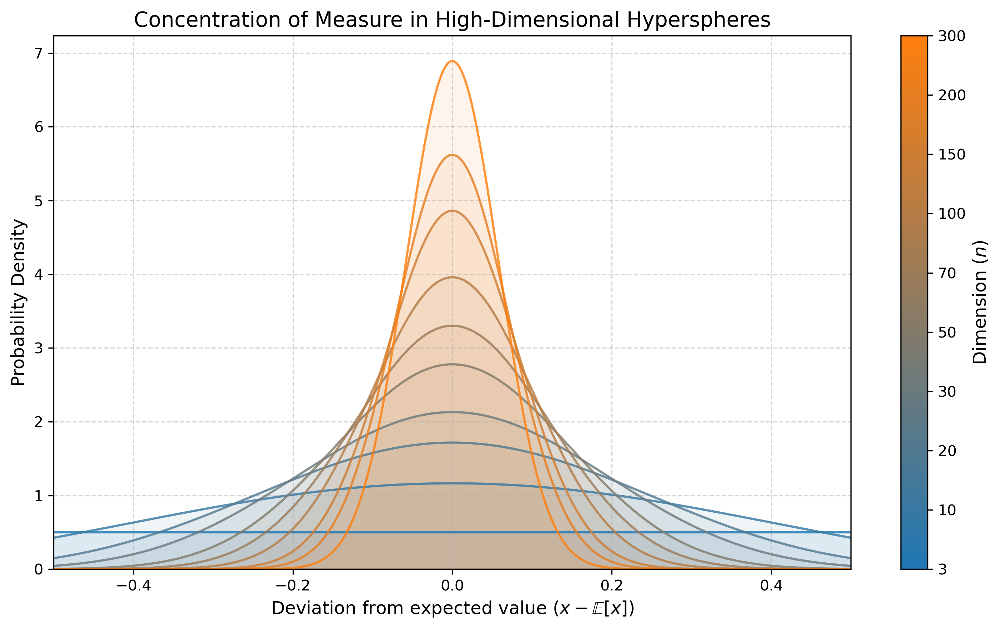

# Introduction

In today's quantum computing era, we are experiencing a lot of drawbacks that deny us the chance of using of the power and advantages that this new technology can provide.

This drawbacks, problems yet to solve, can be conceptually divided into to groups:
- Hardware-driven problems (noise-induced barren plateaus, decoherence, qubit topology, etc...)
- Software-driven problems (mathematically-induced barren plateaus, lack of specific problem-solving algorithims, etc...)

Quantum engineers have developed a bunch of different approaches to solve different problems with quantum systems. In fact, quantum machine learning has been increasing in popularity for the past years because of the theoretical capabilites that they can handle. Even so, at this day and age the advantages are theoretical, and there hasn't been any signs of  quantum supremacy (improvement in contrast with its classical counterpart) in the field of quantum machine learning.

As mentioned before, there is a plethora of reasons that can contribute to this outcome, but in the field of QML, in general, there is a consensus on the most problematic one of all, and the one that is holding back the power of this technology: Barren Plateaus. In this day and age, there are already various proposed solutions (or areas to work into) for the problem at hand, but in the majority of them, the conclusions seemed to not be very conclusive, and the process to archive such solutions tend to be unplanned. The researches know what the problem is, how it happens, but when it comes to solve it, the try whatever they can think of to try and fix it. There is no clear reason behind the proposed changes, and because of that, the idea of mixing different solutions is quite challenging, as in this field any change in any area can have a big impact on the rest of areas.

My thesis will be about this concept, more specifically, about trying to dogde it by using different state-of-the-art solutions proposed for it. This alone wouldn't be so much of a challenge, as it is quite simple to apply any solution for a specific case in which the BP problem is avoided, so instead of doing so, the idea would be to experiment with different solutions based on different theoretical concepts, with the objective of mixing them and propose different mix-approaches that,
in general, can work together to be a stronger option rather than any single-based solution.

## Review of important concepts

### Variational Quantum Algorithms (VQAs)

Variational Quantum Algorithms are hybrid quantum-classical computational frameworks designed to solve optimization problems on Noisy Intermediate-Scale Quantum (NISQ) devices. The architecture consists of a parameterized quantum circuit (often called an Ansatz), denoted by a unitary operation $U(\theta)$, which prepares a quantum state:
$$|\psi(\theta)\rangle = U(\theta)|0\rangle$$
A classical optimizer is then tasked with updating the parameter vector $\theta$ to minimize a specific objective function $C(\theta)$, typically the expectation value of an observable $H$, such that:
$$C(\theta) = \langle \psi(\theta)|H|\psi(\theta)\rangle$$
The Variational Quantum Eigensolver (VQE) is a prominent subclass of VQAs. It leverages the variational principle of quantum mechanics to find the minimum eigenvalue (ground state energy) of a given Hamiltonian $H$. The protocol iteratively measures the energy of the parameterized state and adjusts $\theta$ via the classical control loop until convergence is reached.

### The Barren Plateau Phenomenon

The theoretical advantages of VQAs are severely limited in practice by a trainability crisis known as the Barren Plateau phenomenon. This is not a hardware defect, but a fundamental mathematical barrier that emerges from the geometry of high-dimensional quantum spaces. The phenomenon develops through a strict causal chain:

**Expressibility and Unitary 2-Designs**
If a parameterized quantum circuit is sufficiently deep and entangled, it becomes highly expressive. Mathematically, it generates a distribution of unitaries that forms a unitary $2$-design. This means the statistical distribution of the generated quantum states perfectly mimics the uniform distribution over the entire unitary group (the Haar measure) up to the second statistical moment. At this point, the initial parameters do not provide any localized mathematical structure.

**Concentration of Measure**
Once the circuit forms a $2$-design in an $n$-qubit system, it operates uniformly across a Hilbert space of dimension $D = 2^n$. According to measure theory (Levy's Lemma), any sufficiently smooth function evaluated on a random point drawn uniformly from a high-dimensional space will yield a value extremely close to the function's expected value. The probability of deviation is exponentially bounded:
$$P(|f(x) - \mathbb{E}[f]| \ge \epsilon) \le 2 \exp(-\mathcal{O}(D \epsilon^2))$$

**Exponential Variance Decay (Vanishing Gradients)**
When applying the concentration of measure to the optimization process, the continuous function $f(x)$ is the partial derivative of the cost function, $\partial_{\theta_i} C$. Consequently, the value of the gradient concentrates exponentially around its mean. Since the mathematical mean of the gradient over the parameter space is zero ($\mathbb{E}[\partial_{\theta_i} C] = 0$), the statistical variance of the gradient decays exponentially with the number of qubits:
$$\text{Var}[\partial_{\theta_i} C] \in \mathcal{O}\left(\frac{1}{b^n}\right) | \text{  }b > 1 $$ This exponential decay is precisely the quantum vanishing gradient. Unlike classical neural networks, where vanishing gradients are caused by the chain rule in deep layers, the quantum vanishing gradient is a direct geometric consequence of the Hilbert space dimensionality.

**Intractability on Physical Hardware**
The ultimate consequence of this exponential variance decay is the Barren Plateau. For a classical optimizer to determine a reliable descent direction, the variance of the gradient must stand out against the inherent statistical noise of quantum measurements (shot noise). To estimate a gradient with a variance of $\mathcal{O}(1/b^n)$ to a precision greater than the statistical noise, the number of hardware measurements (shots) required scales exponentially as $\mathcal{O}(b^n)$. This renders the optimization algorithm computationally intractable on physical hardware, paralyzing the training process at step zero.

# The Trainability Threshold: Polynomial vs. Exponential Scaling
While classical machine learning strives for, and achieves, a constant gradient variance $\mathcal{O}(1)$ regardless of network depth, quantum machine learning faces a fundamental mathematical boundary. A constant variance $\mathcal{O}(1)$ in a quantum circuit mathematically implies that the partial derivatives are completely decoupled from the overall system size $n$.

For this decoupling to occur, the circuit must lack significant entanglement. If the qubits do not interact deeply, the global state remains separable, meaning the multi-qubit wavefunction can be factored into a simple tensor product of single-qubit states. A quantum system with zero or strictly limited entanglement can be perfectly and efficiently simulated on a classical computer in polynomial time using tensor network methods.Therefore, forcing a parameterized quantum circuit to maintain an $\mathcal{O}(1)$ variance structurally eliminates the quantum advantage. To solve classically intractable problems, the Ansatz must generate complex, highly entangled states to explore the exponentially large Hilbert space. This entanglement inherently correlates the qubits, making the objective function and its gradients strictly dependent on the system's dimensionality.

Consequently, the theoretical optimum for a useful Quantum Neural Network is to mitigate the exponential decay to a polynomial scale $\mathcal{O}(1/\text{poly}(n))$. This specific scaling provides the necessary mathematical equilibrium: it allows sufficient entanglement to surpass classical computational capabilities while keeping the gradient variance large enough to be resolved by a physical QPU without requiring an exponential number of hardware measurements.

# Solutions

The vanishing gradient problem can be sistematically attacked from 3 different fronts:

## Topology / arquitechture
This category groups all the options that change the Hilbert Space tha the circuit can explore. The objective of this solution is to prevent the system to reach the infamous 
2-design circuit's properties, that basically mean that the variance of the parameters decay exponentially with the degree of the circuit, thus ending up with vanishing gradients

### Cost function (global vs local):

### Depth control (L):

### Problem-based Ansatze:

## Initialization
This group assumes that the arquitecture can have BPs, and thus tries to avoid them from the step 0 of the algorithm

### Random initialization problem:

### Identity initialization:

### Warm starting.

## Training dynamic
Thi category groups the strategies that modify the form in which the classical optimizer interacts with the circuit through time, assuming the arquitecture and the initialization
are already established.

### Layerwise Learning:

### Geometrical preconditioning:

### Dinamyc development of Ansatze:

### Changes on the optimizer:

# Bilbiography